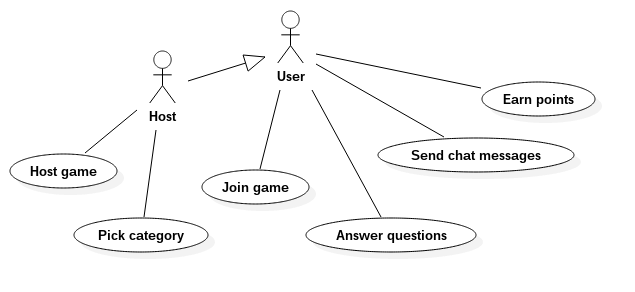

# Pogled slučajeva korišćenja

U ovom dokumentu je dat pogled na slučajeve korišćenja.

Korisnik prilikom pokretanja aplikacije bira da li želi da kreira novu igru ili da se pridruži već kreiranoj igri. Igrač koji je kreirao igru bira kategoriju pitanja, nakon čega igra počinje i korisnici odgovaraju na pitanja. Nakon što su svi igrači odgovorili na pitanje, igrači biraju tačan odgovor. Na raspolaganju je 1 tačan odgovor i odgovori drugih igrača. Odgovori na pitanja bi trebalo da budu šaljiva, a da pritom deluju istinito kako bi ubedili druge igrače da izaberu njihove odgovore kao tačne i time dobiju poene. Naravno, igrači dobijaju poene i ako pogode koji odgovor je tačan. U bilo kom trenutku igrači mogu koristiti čet kako bi međusobno razmenjivali poruke.
 
Pogled slučaja korišćenja je dat na sledećem dijagramu:

